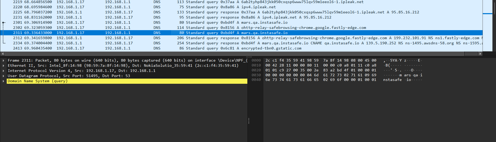
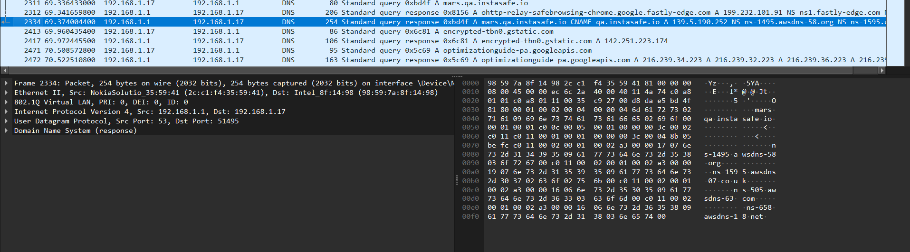
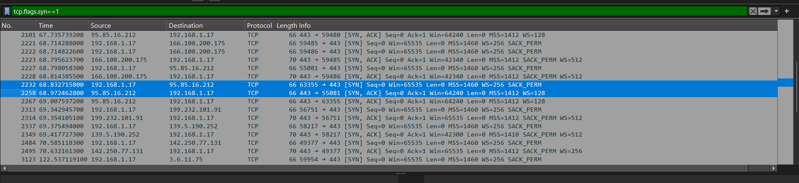
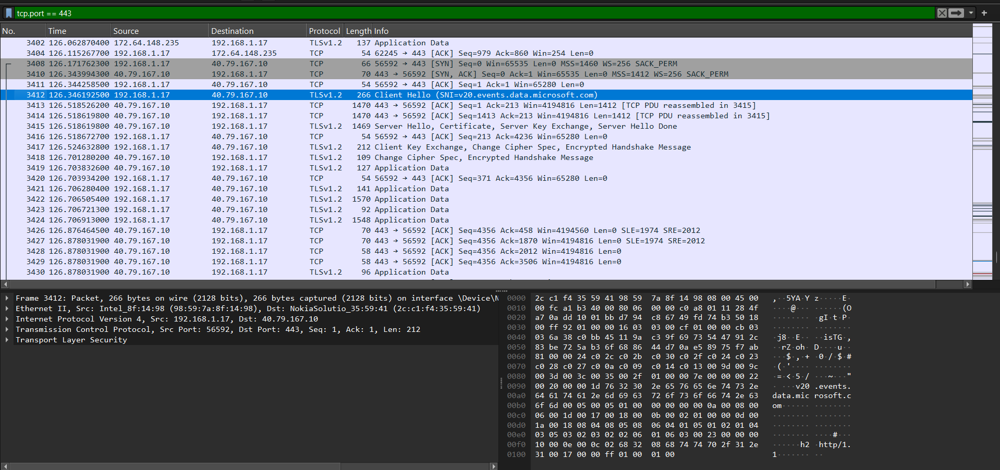
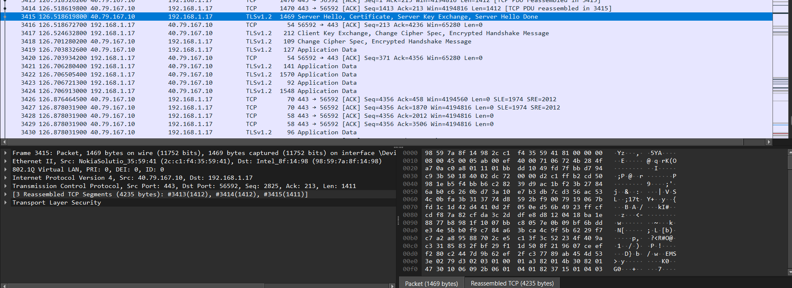
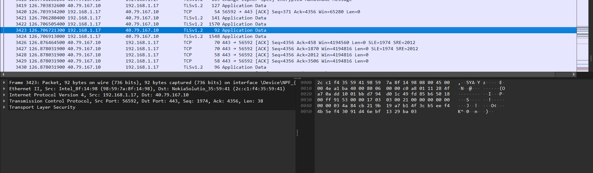
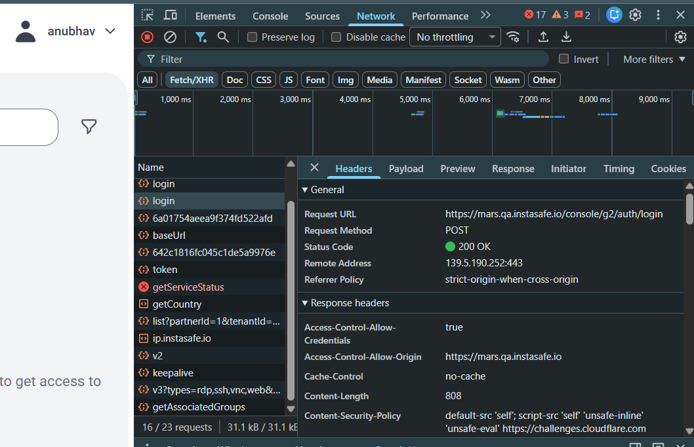

# Lab 0.1 Findings

## Lab Title

Networking Fundamentals – HTTPS Login Flow Analysis

---

## Objective

Capture and analyze HTTPS traffic during a login flow, understand DNS resolution, TCP handshakes, TLS negotiation, and observe the authentication workflow using browser developer tools.

---

## Environment

| Item | Value |
|--------|--------|
| Device | Personal Windows Laptop |
| Browser | Google Chrome |
| Tools Used | Wireshark, Chrome DevTools |
| Target Application | InstaSafe MARS Portal |
| URL | https://mars.qa.instasafe.io |
| Protocols Observed | DNS, TCP, TLS, HTTPS |

---

## Experiment 1: DNS Resolution

### Findings

Before establishing a connection to the InstaSafe portal, the system performed DNS lookups to resolve the hostname.

Observed:

- DNS Query for mars.qa.instasafe.io
- DNS Response returned the target IP address
- DNS resolution completed successfully

This demonstrates the first step of web communication where a hostname must be translated into an IP address before any connection can be established.

---

## Experiment 2: TCP Three-Way Handshake

### Findings

The TCP connection was established using the standard three-way handshake process:

1. Client sent SYN packet
2. Server responded with SYN-ACK
3. Client completed the handshake with ACK

This process establishes a reliable communication channel before TLS negotiation begins.

---

## Experiment 3: TLS Handshake Analysis

### TLS Client Hello

### TLS Server Hello

### Findings

The TLS handshake was successfully observed.

The client initiated communication by sending a Client Hello message containing supported TLS versions and cipher suites.

The server responded with:

- Server Hello
- Certificate
- Key Exchange Information
- Server Hello Done

This process establishes encryption parameters and verifies the server identity before secure communication begins.

---

## Experiment 4: Encrypted Application Traffic

### Findings

After TLS negotiation completed successfully, application traffic was exchanged as encrypted TLS Application Data.

The payload contents were not visible inside Wireshark because TLS encryption protects the HTTP request and response contents from interception.

This demonstrates the security provided by HTTPS.

---

## Experiment 5: Browser DevTools Authentication Analysis

### Findings

The authentication request was analyzed using Chrome Developer Tools.

Observed:

| Parameter | Value |
|------------|---------|
| Endpoint | /console/g2/auth/login |
| Method | POST |
| Status Code | 200 OK |
| Protocol | HTTPS |
| Application | InstaSafe MARS Portal |

The authentication request successfully reached the backend service and returned HTTP 200 OK, indicating successful processing of user credentials and session creation.

---

# VPN vs ZTNA Comparison (QA Perspective)

Traditional VPN solutions provide network-level access to an entire internal network after successful authentication. Once connected, users typically gain visibility to multiple internal systems and services, even if they only need access to a single application. From a QA perspective, VPN testing focuses on tunnel connectivity, route propagation, DNS behavior, and network accessibility.

Zero Trust Network Access (ZTNA) follows a different approach. Instead of granting broad network access, ZTNA provides access only to explicitly authorized applications. Authentication, device posture checks, user identity, and access policies are continuously evaluated before allowing access to resources.

In the observed InstaSafe workflow, the user authenticated through a secure HTTPS login flow. The communication was protected using TLS encryption, and access was controlled through application-level authentication mechanisms. Unlike a VPN, users are not required to receive unrestricted access to internal network segments.

For QA engineers, ZTNA testing focuses on authentication workflows, policy enforcement, application accessibility, identity validation, and session management rather than broad network reachability. This reduces attack surface and aligns with Zero Trust security principles where access is granted only to the specific resource required by the user.

---

## Conclusion

This lab demonstrated the complete flow of a secure web authentication process.

The workflow included:

- DNS hostname resolution
- TCP three-way handshake
- TLS handshake and certificate exchange
- Encrypted HTTPS communication
- Authentication request analysis using browser developer tools

The exercise provided practical visibility into how modern secure web applications establish trusted and encrypted communication channels while protecting user credentials and application traffic.
