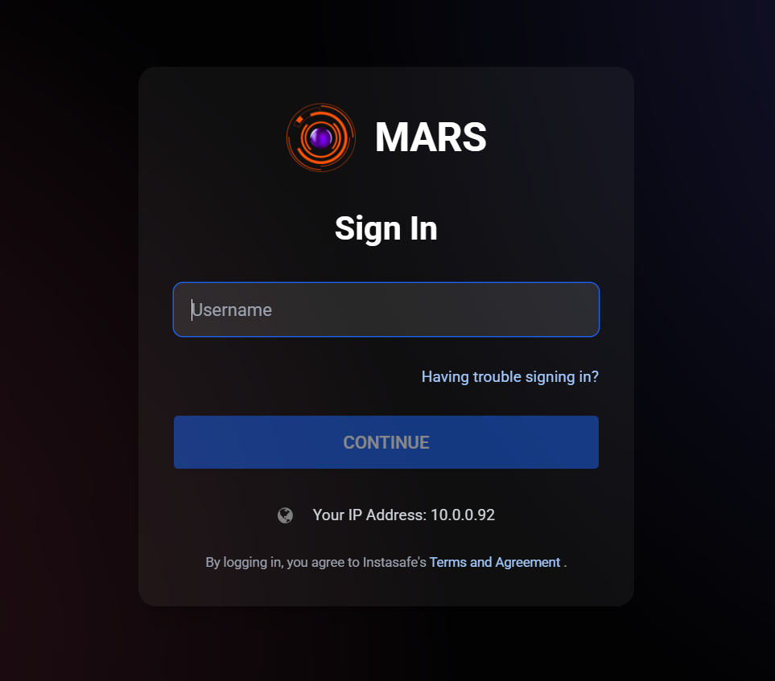
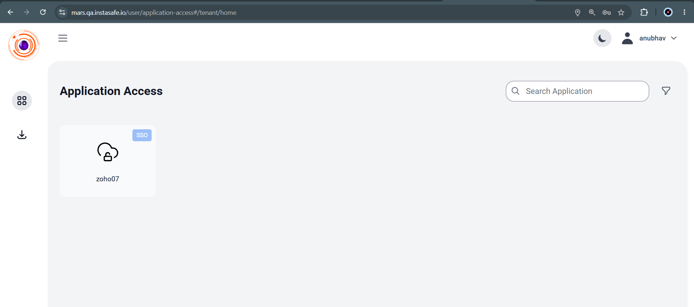
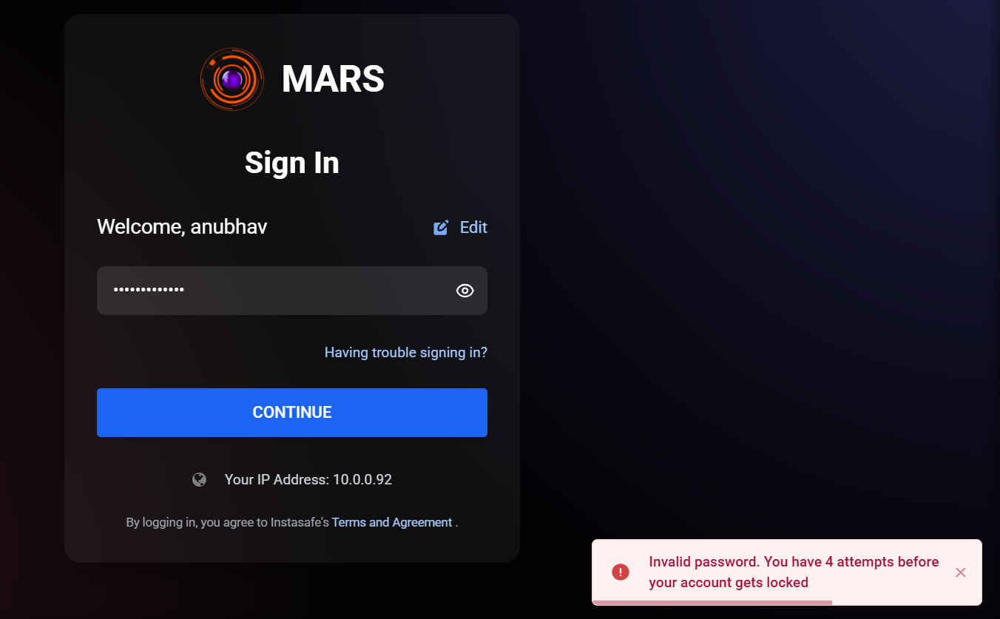
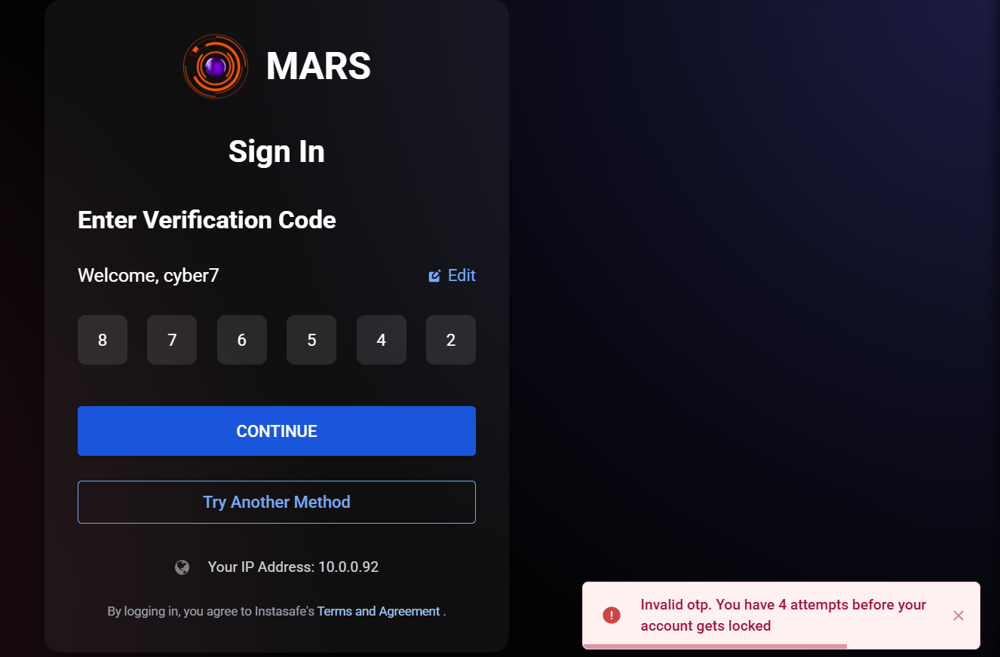
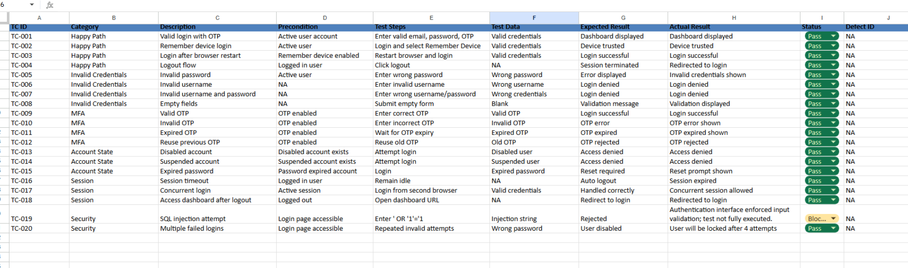

# Lab III.2 Findings

## Lab Title

Test Case Design and Execution – MFA Login Workflow

---

## Objective

The objective of this lab was to design and execute structured test cases for the InstaSafe MFA authentication workflow. Testing included positive scenarios, negative scenarios, MFA validation, account state validation, session management checks, and basic security validation.

---

## Environment

| Item | Value |
|--------|--------|
| Application | InstaSafe MARS Portal |
| Authentication Method | Username, Password and MFA |
| Browser | Google Chrome |
| Test Type | Functional Testing |
| Test Design Technique | Positive and Negative Testing |
| Total Test Cases | 20 |

---

## Test Case Design

A total of 20 test cases were designed and documented covering the following categories:

- Happy Path Scenarios
- Invalid Credential Validation
- MFA Validation
- Account State Validation
- Session Behaviour
- Security Validation

The complete test case sheet is available in:

`test-cases-mfa-login.xlsx`

---

## Test Execution Evidence

### Login Page

### Successful Login

### Invalid Password Validation

### Invalid OTP Validation

### Session Validation

### Test Case Sheet

---

## Test Results Summary

| Metric | Count |
|----------|---------|
| Total Test Cases | 20 |
| Passed | 19 |
| Failed | 0 |
| Not Executed | 1 |
| Pass Rate | 95% |

---

## Findings

The MFA authentication workflow behaved as expected across all executed test scenarios.

Observed behaviour:

- Valid users successfully authenticated.
- Invalid credentials were rejected.
- Incorrect OTP values were rejected.
- Expired OTP validation behaved correctly.
- Session management controls functioned correctly.
- Protected pages required authentication.
- Logout functionality successfully terminated active sessions.
- No critical defects were identified during testing.

Overall authentication reliability remained stable throughout the testing process.

---

## Challenges

One planned security validation scenario involving SQL injection style input could not be fully executed because the login page enforced strict email format validation before authentication processing.

This behaviour itself demonstrates a positive security control because malformed input was rejected before reaching the authentication workflow.

---

## Conclusion

This lab demonstrated the complete process of designing, executing, and documenting authentication test cases for a Multi-Factor Authentication (MFA) workflow.

The testing covered positive scenarios, negative scenarios, session validation, and security-focused checks. The InstaSafe MFA implementation met the expected functional requirements and no critical authentication defects were identified during testing.

---

## Deliverables

- Test Case Spreadsheet: `test-cases-mfa-login.xlsx`
- Test Execution Summary: `execution-summary.md`
- Supporting Screenshots: `screenshots/`
